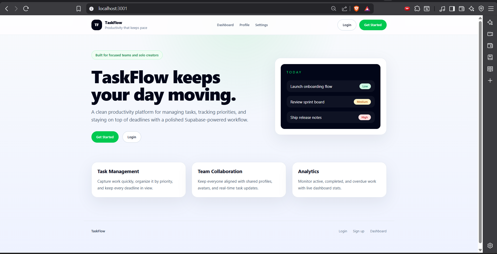
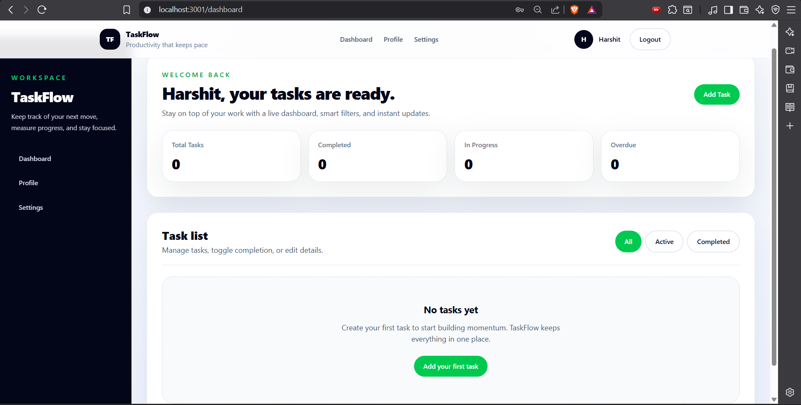
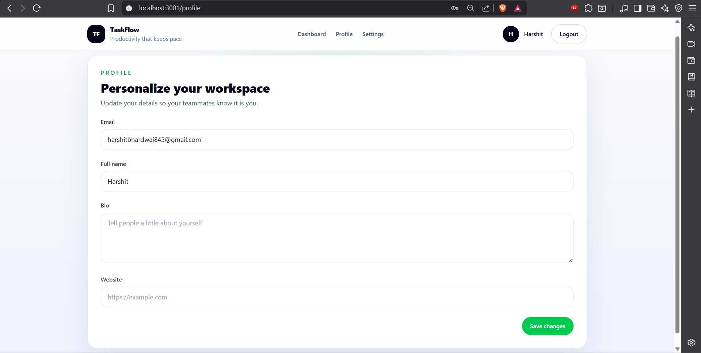
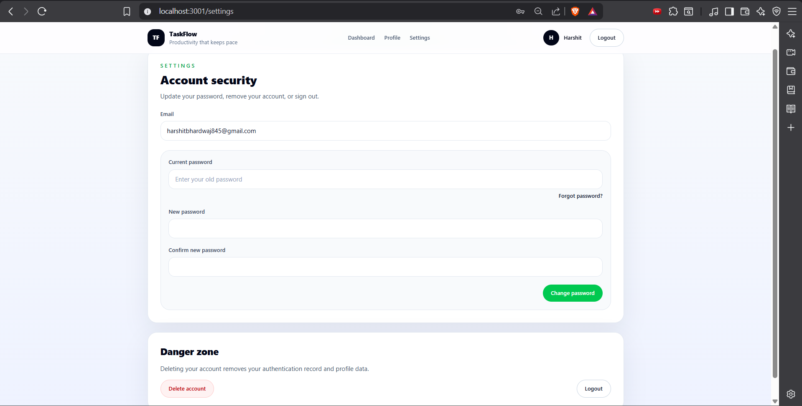

# TaskFlow


TaskFlow is a production-style task management web application built with Next.js, Supabase, TypeScript, and Tailwind CSS. It provides authentication, protected dashboards, task management, profile editing, password recovery, and account settings in a clean, responsive interface.

## Description

TaskFlow helps users organize daily work in one place. It includes secure authentication, a protected dashboard, task creation and management, profile editing, password recovery, and account settings backed by Supabase authentication and PostgreSQL.

## Live Demo

Deployed website: https://my-auth-data-backend-ltmf.vercel.app/

## Features

- Email and password authentication
- Email verification and password recovery flow
- Protected dashboard, profile, and settings pages
- Create, edit, complete, and delete tasks
- Task filtering by status
- Task priority levels and due dates
- Real-time dashboard refresh behavior
- Profile management with full name, bio, and website
- Account security actions such as password update and account deletion
- Responsive UI built with Tailwind CSS

## Tech Stack

| Layer | Technologies |
| --- | --- |
| Frontend | Next.js, React, TypeScript, Tailwind CSS |
| Backend | Supabase Auth, Supabase SSR, Next.js Route Handlers |
| Database | Supabase PostgreSQL |
| Services | Supabase Email Auth |
| Tools | npm, Git, Vercel, ESLint |

## Installation Instructions

### 1. Clone the repository

```bash
git clone https://github.com/Harshit-bhardwaj08/my-auth-data-backend
cd my-auth-data-backend
```

### 2. Install dependencies

```bash
npm install
```

### 3. Configure environment variables

Create a `.env.local` file in the project root and add the required variables listed below.

### 4. Set up Supabase database tables

Run the SQL schema from the `supabase/migrations/20221017024722_init.sql` file inside the Supabase SQL editor.

### 5. Start the development server

```bash
npm run dev
```

Open `http://localhost:3000` in your browser.

## Environment Variables

Create a `.env.local` file and provide the following values:

| Variable | Required | Purpose |
| --- | --- | --- |
| `NEXT_PUBLIC_SUPABASE_URL` | Yes | Supabase project URL |
| `NEXT_PUBLIC_SUPABASE_PUBLISHABLE_KEY` | Yes | Supabase public anon/publishable key |
| `SUPABASE_SERVICE_ROLE_KEY` | Optional | Required only for admin actions such as account deletion |

Example:

```env
NEXT_PUBLIC_SUPABASE_URL=https://your-project.supabase.co
NEXT_PUBLIC_SUPABASE_PUBLISHABLE_KEY=your_publishable_key_here
SUPABASE_SERVICE_ROLE_KEY=your_service_role_key_here
```

## Usage Instructions

1. Sign up with your email address and password.
2. Confirm your email address if verification is enabled in Supabase.
3. Sign in to access the dashboard.
4. Create tasks using the task form.
5. Filter, edit, complete, or delete tasks as needed.
6. Visit the profile page to update your full name, bio, and website.
7. Use the settings page to change your password or delete your account.

## Folder Structure

| Path | Description |
| --- | --- |
| `app/` | Next.js App Router pages, layouts, and routes |
| `components/` | Reusable UI components and forms |
| `lib/` | Shared utilities and Supabase client helpers |
| `supabase/` | SQL migrations and Supabase configuration files |
| `public/` | Static assets |

## Scripts

| Command | Description |
| --- | --- |
| `npm run dev` | Start the development server |
| `npm run build` | Build the application for production |
| `npm run start` | Start the production server |
| `npm run lint` | Run lint checks if configured in the project |

## Screenshots

### Homepage / Landing Page



### Dashboard



### Profile Page



### Settings Page



## Deployment Instructions

1. Push the repository to GitHub.
2. Deploy the project to Vercel or your preferred Next.js hosting platform.
3. Add all production environment variables in the hosting dashboard.
4. Update Supabase auth redirect URLs to match the deployed domain.
5. Redeploy after any environment or schema changes.

## Known Issues / Troubleshooting

- If authentication fails, confirm that Supabase environment variables are correct.
- If task data does not load, verify that the database schema and Row Level Security policies were applied correctly.
- If password reset emails are not sent, check Supabase email rate limits and SMTP configuration.
- If a route redirects incorrectly, ensure the middleware and auth callback URLs match the deployed environment.
- If the app shows a stale UI, clear the browser cache and restart the development server.

## Future Improvements

- Task search and advanced sorting
- Task tags and categories
- Due date reminders and notifications
- Dark mode support
- Task analytics and productivity insights
- Better audit and activity logs

## Contributing Guidelines

1. Fork the repository.
2. Create a feature branch.
3. Make your changes with clear, focused commits.
4. Test the project locally before opening a pull request.
5. Submit a pull request with a concise description of the changes.

## License

This project is licensed under the MIT License.
